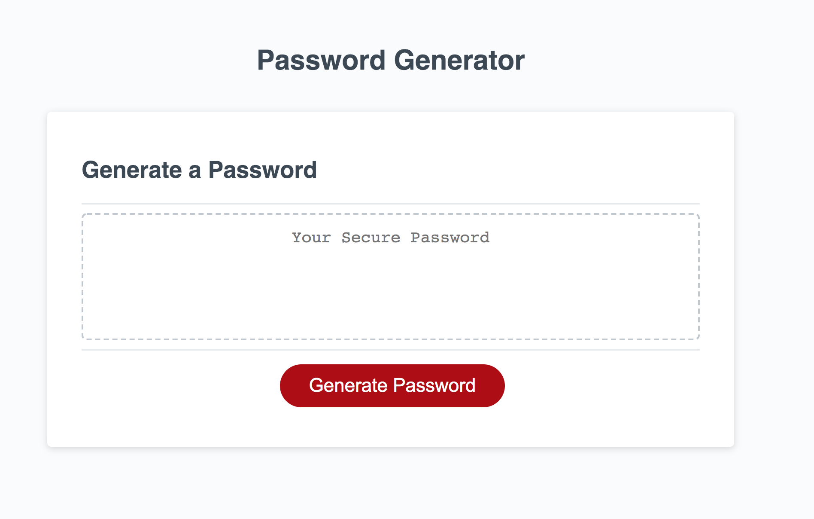
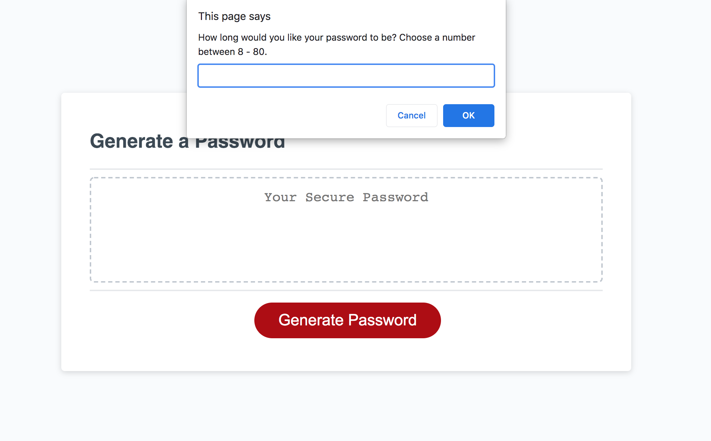

# PasswordGenerator

## Description

The following program is a Password Generator. When you press on the "Generate Password" button, the site will provide the user with various components of a password, to include or not to include. This was a particularly difficult project for me to complete as I found myself researching and receiving many different ways to produce the same final task. This left me with overly complicated code that I was not proud of or wanting to publish. As a result, my repository is lacking multiple commits, unlike my previous projects. I do, however, recognize the importance of creating multiple commits as way to track changes and backup your repository.
 

## Credits

Throughout this project, I continued to work within various study groups to brainstorm ideas on different ways to modify the code, in order to work. My tutor also played a large role in helping me consolidate my code to be more dynamic and straight forward. 


## Acceptance Criteria

```
GIVEN I need a new, secure password

WHEN I click the button to generate a password
    THEN I am presented with a series of prompts for password criteria
WHEN prompted for password criteria
    THEN I select which criteria to include in the password
WHEN prompted for the length of the password
    THEN I choose a length of at least 8 characters and no more than 128 characters
WHEN asked for character types to include in the password
    THEN I confirm whether or not to include lowercase, uppercase, numeric, and/or special characters
WHEN I answer each prompt
    THEN my input should be validated and at least one character type should be selected
WHEN all prompts are answered
    THEN a password is generated that matches the selected criteria
WHEN the password is generated
    THEN the password is either displayed in an alert or written to the page
```

## Link to Deployed Application

https://parisa-ostovari.github.io/PasswordGenerator/

## Link to GitHub Repository

https://github.com/parisa-ostovari/PasswordGenerator

## Screenshot
Here is the snapshot of how the website should look like:
 
 When first opened:


 When Generate Password button is clicked on:


